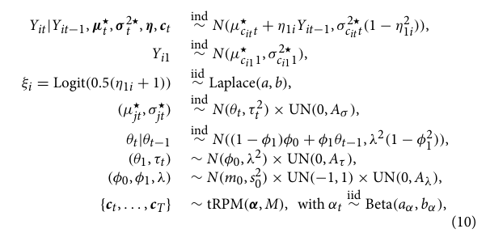

I write the summary here in a Rmd file as it can be rendered with html for better reading, and here i can include sections of code, math latex stuff, ecc.

# Paper 1
The original one referenced, of Page and Quintana. Very complex, but understandable. Again (as in paper 4), it is not written clearly how (or if it is possible) to include covariates. But basing on other models I thougth of a way, but i dont know yet how to justify it properly (like with references.)

That is their main model we can use. But
- we have to change tRPM to stRPM to include both spatio and temporal info
- about covariates maybe we can include them in the definition law of Y, as we do in LMs, ie like

$$
\text{their model}\\
Y_{it}|... \sim \mathcal{N}( \mu^\star_{c_{it}t}+ \eta_{1i}Y_{it-1}, ...)\\
\text{new model with covariates}\\
Y_{it}|... \sim \mathcal{N}( \mu^\star_{c_{it}t}+ \eta_{1i}Y_{it-1} +\vec{\beta}\cdot \vec{x}_{it}, ...)\\
$$

# Paper 4
Not very useful, funny model on graphs, but it does not involve the use of covariates.

# Paper 5
Seems better for now. Still reading it.
(´。＿。｀)

